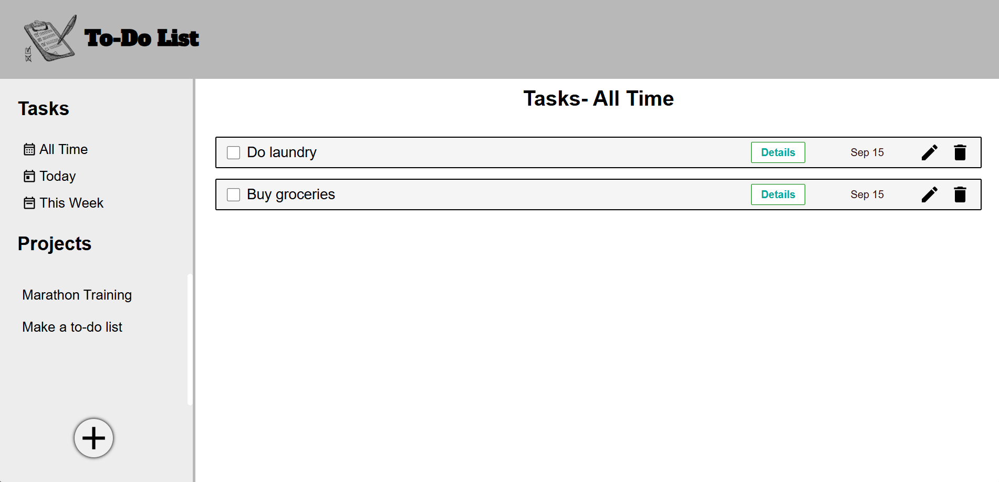

# todo-list
This Todo List app helps users organize tasks efficiently, allowing them to create, edit, and manage projects and individual tasks. Features include adding due dates, setting task priorities, and marking tasks as complete. The app provides a user-friendly interface with task details, priority selection, and project grouping to keep everything organized.

Key Features:

Add, edit, and delete tasks
Set task priorities (Low, Medium, High)
Assign due dates to tasks
Project-based task organization
Responsive design for various screen sizes

[Live Demo](https://muhibk22.github.io/todo-list/) 👈

